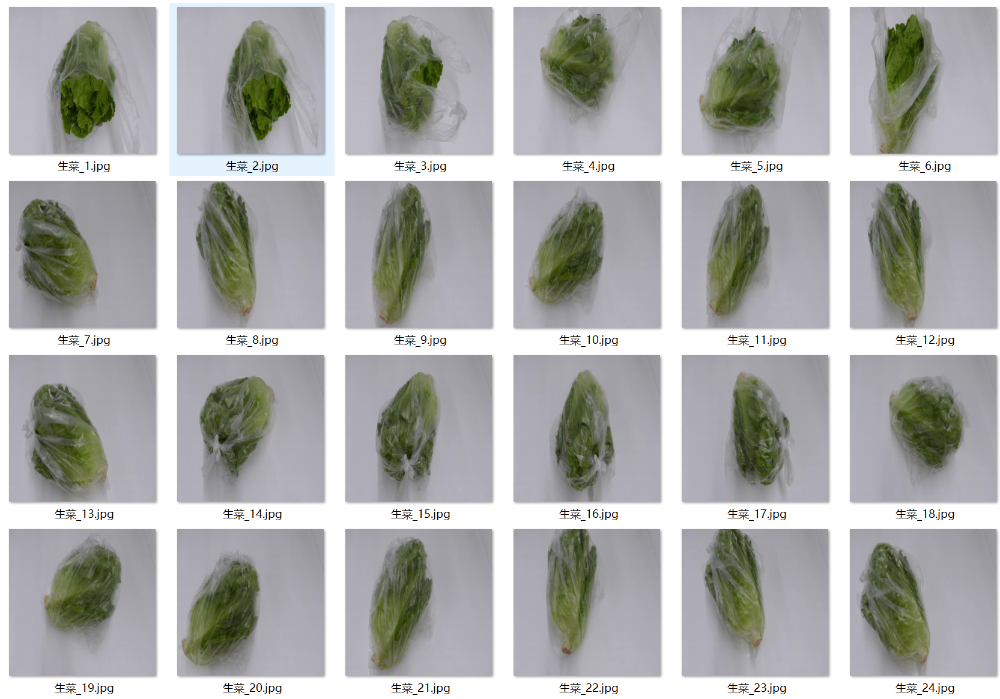

# 18 Types of Common Vegetables Image Classification Dataset

Dataset Information Introduction: The number of images in the folder "Shanghai Green" is: 207
The number of images in the folder "Potato" is: 1194
The number of images in the folder "Epao Ye" is: 200
The number of images in the folder "Guangdong Caixin" is: 243
The number of images in the folder "You Maicai" is: 198
The number of images in the folder "Shengcai" is: 281
The number of images in the folder "Kongxiao Cai" is: 209
The number of images in the folder "Hongyancai" is: 179
The number of images in the folder "Houpai Cai" is: 246
The number of images in the folder "Hua Cai" is: 1000
The number of images in the folder "Xilan Cai" is: 95
The number of images in the folder "Ji Baicai" is: 263
The number of images in the folder "Xi Hua Cai" is: 650
The number of images in the folder "Jiao Cai" is: 1643
The number of images in the folder "Jian Mao Cai" is: 248
The number of images in the folder "Cun Gua" is: 1000
Total number of images in all subfolders: 9609
Screenshot:
For inquiries, just ask! I don't need to confirm friend verification. You can directly send me messages, and I can see them.
Search for me, and you can ask your questions at once. I will reply to you, sometimes I am busy. You should describe clearly what you want to know.
When I am free, I will also reply to you. There's no need for formalities, this will make things more efficient.
Phone number is the same as above. If I forget to reply or you are impatient, you can send a text message or call.

## Images

Here is a pay link on Stripe ( https://buy.stripe.com/3cs8yP7sY87d0vu9AB ). Please contact me lonlonago@foxmail.com after funding $89, and I will send you a complete data files , thank you!

